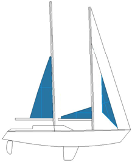

.. _anhang-reffplan:

============
A.7 Reffplan
============

Nachfolgend der offizielle Reffplan aus dem Stabilitätshandbuch.

.. contents::
   :local:

Volle Segel 1
--------------

**< 5 Bft**
(Windgeschw./Berechnungsgrundlage: 8,82 m/s; 16,5 kn)

  * Groß
  * Schoner
  * Blister

Volle Segel 2
--------------

**< 5 Bft**
(Windgeschw./Berechnungsgrundlage: 9,7 m/s; 18,5 kn)

  * Groß
  * Schoner
  * Genua

Reff 1
-------

**< 5 Bft**
(Windgeschw./Berechnungsgrundlage: 10,7 m/s; 20,5 kn)

  * Groß
  * Schoner 1. Reff
  * Fock
  * Klüver

Reff 2
-------

**6 Bft**
(Windgeschw./Berechnungsgrundlage: 11,85 m/s; 23 kn)

  * Groß 1. Reff
  * Schoner 2. Reff
  * Fock
  * Klüver
  

.. Hint:: Das Groß kommt hier ins 1. Reff; die Abbildung ist nicht korrekt.

Reff 3
-------

**6 Bft**
(Windgeschw./Berechnungsgrundlage: 13,34 m/s; 25,5 kn)

  * Groß 2. Reff
  * Schoner 3. Reff
  * Fock
  * Klüver

Reff 4
-------

**7 Bft**
(Windgeschw./Berechnungsgrundlage: 18,95 m/s; 30,5 kn)

  * Groß 3. Reff
  * Schoner 3. Reff
  * Fock

Reff 5
-------

**8/9 Bft**
(Windgeschw./Berechnungsgrundlage: 22,03 m/s; 44 kn)

  * Groß 3. Reff
  * Sturmklüver

Alter Reffplan
---------------

Neue und alte Segelanweisung im Vergleich
-----------------------------------------

