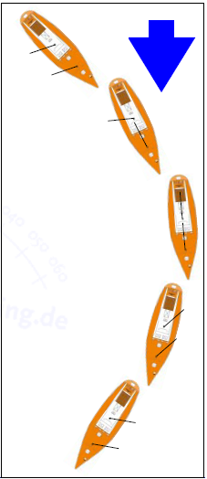

Segelmanöver
------------

Gefahren bei den Segelmanövern sind:

  * Schlagen der Vorsegelschoten
  * Überkommende Bäume – Patenthalse
  * Überläufer auf den Winschen
  * Schotklemme des Großsegel löst sich (bei viel Wind sollte die Schottalje und die Blisterwinsch zum Sichern genutzt werden)
  * Nicht die Großschot über die Blisterwinschen ganz achtern dichtholen, da der Winkel nicht stimmt, damit vertwistet man die Großschot
  * Quetschungen der Finger
  * "Peitschenhiebe" durch freie Tauenden im Gesicht

.. Tip:: Für den genauen Ablauf und alle Kommandos der Segelmanöver, siehe Segelheft für Trainees und Stammcrew (befindet sich zur Zeit in Überarbeitung)

Tipps zur Segelführung:

  * Bei Raumschotkursen (ab ca. 3 Bft.) Groß ins 1. Reef, da der Schoner dann besser angeströmt wird. Die Steuerfähigkeit wird verbessert
  * Bei Halb-Wind-Kursen: Schoten gut durchholen
  * Bei Am-Wind-Kursen Segel von vorn nach achern weiter offen  fahren, da die leeseitige Anströmung günstiger wird. Leichte Gegenbäuche sind dann normal
  * Starke Krängung reduziert die Geschwindigkeit. Reffen!
  * Die achten Winschen im Cockpit sind für den Blister gedacht und sollen nicht zum durchholen der Großschot benutzt werden, da der Winkel dafür nicht stimmt und dies die Großschot auf Dauer beschädigt

.. Tip:: In den losen Schoten sind die Knoten
  
^^^^^
Wende 
^^^^^

**Wende** - das Schiff geht mit dem Bug durch den Wind

  * Vorschiff und Schoten besetzen
  * Rudergänger oder Manöverleiter gibt das Segelkommando „Ree“ - zügig anluven
  * Vorsegel über
  * Vor Erreichen des neuen Kurses Stützruder geben
  * Der effektive Wendewinkel beträgt auf der Esprit ca. 100°

^^^^^
Halse 
^^^^^
  

**Halse** - das Schiff geht mit dem Heck durch den Wind

  * Vorschiffschoten besetzen
  * Cockpit: Groß- und Schonerschoten, sowie Beiholer besetzen
  * Eventuell angeschlagene Bullenstander lösen
  * Raumschotskurs fahren, bis Schoner leicht im Windschatten des Großsegels steht. (Gefahr Patenthalse Schoner)
  * Schonerschot und Beiholer dicht
  * Evtl. aus Sicherheitsgründen wieder ein wenig anluven und die Großschot dicht holen (vermeidet bei achterlichem Seegang eine Patenthalse des Groß)
  * Kommando „Rund achtern“ (Achtung im Bereich der Schoten!) und langsam abfallen
  * Wenn Groß- und Schonersegel überkommen, dann zügig die Schoten auffieren (1-2 Törns über die Winschen nehmen) und ordentlich Stützruder geben
  * Groß-, Schonerschoten und Beiholer öffnen
  * Vorsegel schiften
  * Bullenstander evtl. wieder setzen
  
^^^^^^
Reffen
^^^^^^

  * Frühzeitig reffen - Reffplan beachten
  * Schoner tendenziell eine Reffstufe kleiner fahren
  * Von vorn nach achtern reffen
  * Möglichst nicht vor dem Wind reffen
  * Wird vor dem Wind abgelaufen, zuerst das Großsegel verkleinern
  * Mehr als 20° Krängung reduziert die Geschwindigkeit und belastet unnötig Mensch und Material
  * Für Schoner rund Groß gibt es je 3 Reffs
  * Kicker lösen
  * Fall bis zu gewünschten Halsauge fieren, beim Schoner Piek und Klaufall fieren
  * Schot evtl. leicht auffieren, um Druck im Segel zu reduzieren
  * Gleichzeitig die Lose aller 3 Reffleinen von Hand holen (sonst schlagen sie und  können sich dabei gefährlich umeinander schlagen)
  * Halsauge auf einer beliebigen Seite in Reffhaken einhängen
  * Entsprechende Reffleine zügig per Winsch durchsetzen
  * Fall durchsetzen
  * Segel kann gefahren werden
  * Danach evtl. Segel mit Reffzeising zusammenhalten, von vorne nach achtern, nicht fest ziehen, Reffstert achtern mit Zeising extra sichern
  * Segel kann gefahren werden

.. Seealso:: :ref:`schwerwetter`
